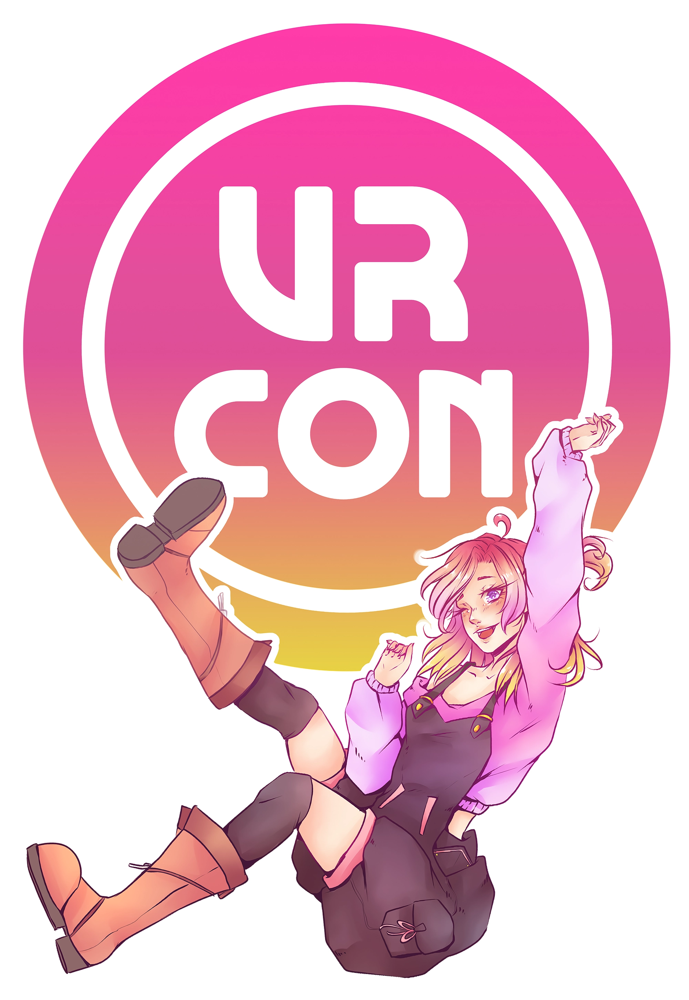

# VRCon Website

In preparation for VRCon 2022!

<div align="center">
	
</div>

## Powered By
- Vue 2.x +Vue Router
- Vuetify
- Love ❤️

---

## Project setup
```
npm install
```

### Compiles and hot-reloads for development
```
npm run serve
```

### Compiles and minifies for production
```
npm run build
```

### Lints and fixes files
```
npm run lint
```

### Customize configuration
See [Configuration Reference](https://cli.vuejs.org/config/).


# Build to Live Site

#### Step 0: in `store.js`, set `debugValue: false`
#### Step 1: run `npm run build -- --mode=production` (mode=production will set the .env to reference the .env.production)
#### Step 2: Copy `index.html` contents to `404.html`

#### Step 3: run `git add dist` and `git commit -m'Your Message Here'`
#### Step 4: run `git subtree push --prefix dist origin Live`

#### Step 5: in in `store.js`, set `debugValue: process.env.VUE_APP_DEBUG,`

Details can be found [here](https://learnvue.co/tutorials/deploy-vue-to-github-pages)
